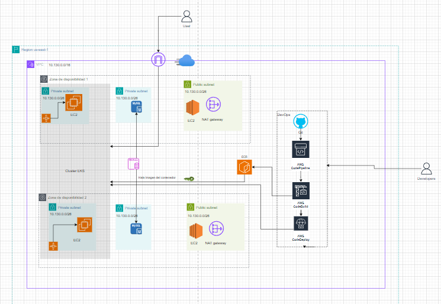

# Proyecto Final Talento Tech - Arquitectura en nube

Este repositorio contiene el proyecto final del Bootcamp de Arquitectura en Nube. El repositorio tiene por nombre **PRY-TalenTech**, donde se encuentra la creación de la infraestructura en AWS base para el despliegue de una aplicación contenerizada en EKS.

## Tabla de Contenidos

- [Descripción](#descripción)
- [Requisitos Previos](#requisitos-previos)
- [Instalación](#instalación)
- [Uso](#uso)
- [Arquitectura](#Arquitectura-del-proyecto)
- [Autores](#Autores)

## Descripción

**PRY-TalenTech** es un repositorio donde se encuentran tres carpetas principañes que contienen los codigos fuentes de la implementación.
- CloudAPP: Donde esta el despliegue de la infraestructura de la aplicación. En APP hay un ejemplo de despliegue de un deployment, service y ingress en la infra base.
- Modules: Se encuentran los modulos de terraform para el despliegue de la VPC, RDS y EKS. El modulo de la VPC esta local, los otros refieren a los modules de provider AWS para terraform.
- Templates: Archivos de despliegue de la infraestructura por medio de los servicios de AWS CodeBuild y Codepipeline. 

En conjunto permiten la creación de la infraestructura base para la implementación del proyecto siguiendo las indicaciones entregadas.

## Requisitos Previos

Antes de ejecutar el proyecto, asegúrate de tener los siguientes requisitos instalados:

- [Requisito 1] - [Se debe contar con una cuenta en AWS]
- [Requisito 2] - [Se debe tener un conocimiento base en terraform y AWS]
- [Requisito 3] - [Hacer uso de los modulos y el codigo encontrado en este repositorio teniendo en cuenta los comentarios dentro del mismo para un uso efectivo]

## Instalación

Para clonar y ejecutar este proyecto en tu máquina local, sigue estos pasos:

1. Clona el repositorio:
   ```bash
   git clone https://github.com/Sebastian26Git/PRY-TalenTech.git
2. Navega al directorio del proyecto:
   ```bash
   cd PRY-TalenTech
3. Inicar con los ajustes correspondientes. 


## USO

Se puede realizar el despliegue de una aplicación de manera rapida haciendo uso de este repositorio en general, las plantillas o modules base permiten con unos pequeños ajustes llevar a cabo el despliegue de la infraestructura necesaria. 

## ARQUITECTURA

La siguiente imagen muestra la arquitectura de la solución propuesta y desplegada por medio del codigo que se encuentra en este repositorio.



## Autores

- Sebastian Barón
- Julio Diaz
- Wilson Aguilar


